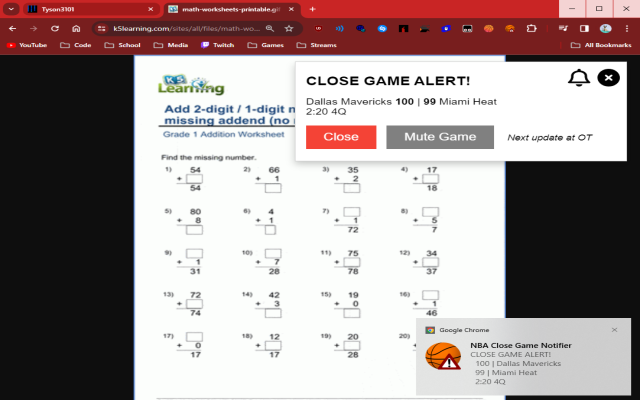

# [Close-Game-Notifier](https://github.com/Tyson3101/Close-Game-Notifier)

## A Chrome Extension that notifies you when a game is intense in the NBA (Maybe more sports soon)!

#### Whenever an NBA game is close, the extension will notify you (in many customizable ways) so you don't miss any exciting finishes!

- Extension: [Click here](./README.md#extension)

## Extension

**Option 1** – Install it from the [Chrome Web Store](https://chrome.google.com/webstore/detail/bplloekadjdcfpdpabfpgcmmdcdmgcko)

**Option 2** – Install it from source:

- Clone/download this repo,
- Open Chrome and go to `chrome://extensions`,
- Enable "Developer mode",
- Click "Load unpacked extension",
- Select the `extension` folder from this repo.

##### If you have any suggestions or experience problems, post an issue on the GitHub page: [https://github.com/Tyson3101/Close-Game-Notifier/issues](https://github.com/Tyson3101/Close-Game-Notifier/issues)

###### By Tyson3101
